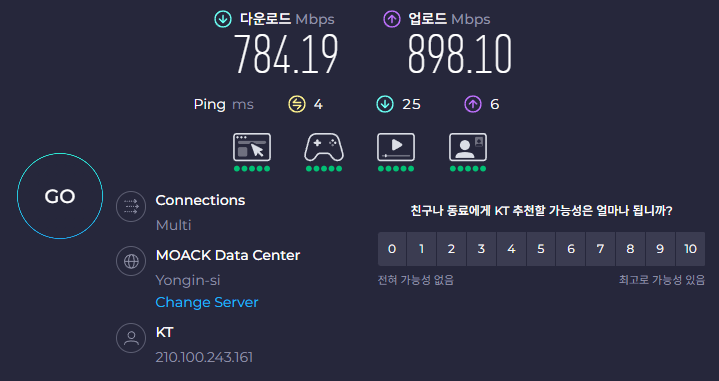
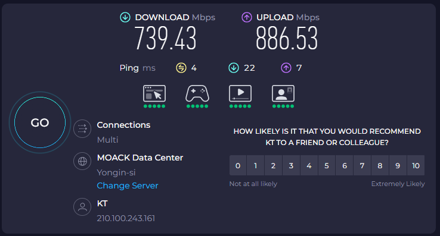
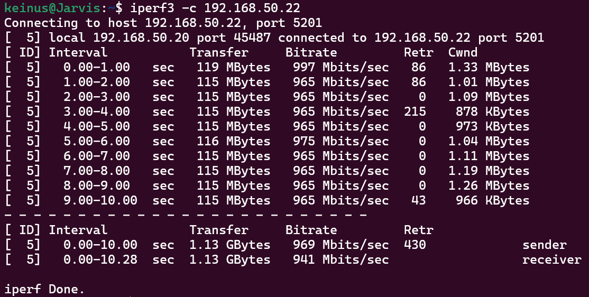
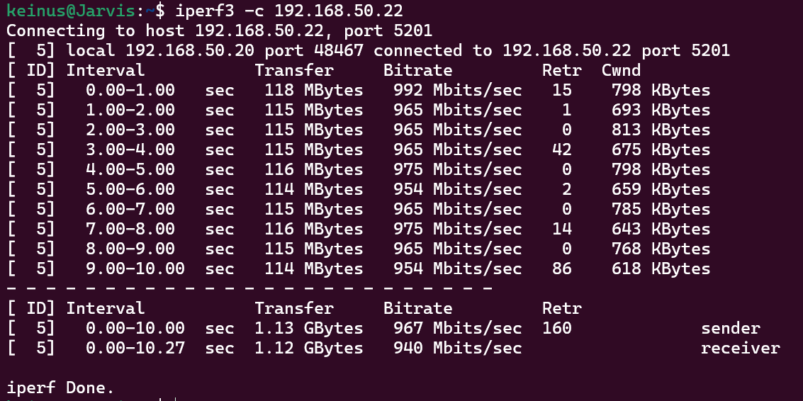

# Linux 기반 Bridge IPS 구현

Linux 머신에서 bridge 설정으로 bypass interface를 주고, bypass interface에서 이상을 탐지하여 pass/drop하는 기능 구현  
기타 로깅이나 필요 설정 등을 구현  

## HW

alibaba에서 판매되는 pfsense용 N100 미니 PC를 사용

- Intel N100
- 16GB RAM
- 512GB NVME SSD
- 2.5GBps Ethernet 4 Port(I226-V (rev 04))

## 전제 조건

1. 인터페이스 하나는 관리용으로 IP가 설정되어 있고, 접속 가능해야 한다.
2. 본 문서는 Ubuntu 24.02 LTS를 사용한다.
3. SSH로 접속 가능해야 한다.

## 인터페이스 설정

구성

```ASCII
[PC1] ←→ [eth0]  BRIDGE-PC  [eth1] ←→ [PC2]
                   |
                suricata 실행
```

---

| 항목 | 값 |
|------|---|
|브리지 이름|sniffbr0|
|NIC 1(Bypass)|enp3s0|
|NIC 2(Bypass)|enp4s0|

### netplan 설정

아래 파일을 편집한다.  

```bash
sudo nano /etc/netplan/01-sniffbridge.yaml
```

아래 내용으로 설정한다.

```yaml
network:
  version: 2
  ethernets:
    enp3s0: {}
    enp4s0: {}
  bridges:
    sniffbr0:
      interfaces: [enp3s0, enp4s0]
      dhcp4: no

```

적용한다.  

```bash
sudo netplan apply
```

### Promisc 설정

아래 파일을 편집한다.  

```bash
sudo nano /etc/systemd/system/promisc-mode.service
```

아래 내용으로 작성한다.

```ini
[Unit]
Description=Set NICs to Promiscuous Mode
After=network.target

[Service]
Type=oneshot
ExecStart=/usr/local/bin/set-promisc.sh
RemainAfterExit=yes

[Install]
WantedBy=multi-user.target
```

아래 스크립트를 생성한다.  

```bash
sudo nano /usr/local/bin/set-promisc.sh

```

아래 내용으로 작성한다.  

```bash
#!/bin/bash
ip link set enp3s0 promisc on
ip link set enp4s0 promisc on
ip link set sniffbr0 promisc on
```

아래 명령을 실행한다.

```bash
sudo chmod +x /usr/local/bin/set-promisc.sh
sudo systemctl enable promisc-mode.service
sudo systemctl start promisc-mode.service
```

여기까지 하면 2개의 bypass 인터페이스를 사용하고, 해당 인터페이스를 통해 IDS가 가능한 구조를 구성할 수 있다.  

## Suricata 설치(docker)

suricata를 설치하고, config를 적절히 설정한다. 그냥 설정 안하고 써도 된다.  

```yaml
services:
  suricata:
    image: jasonish/suricata:latest
    container_name: suricata
    cap_add:
      - net_admin
      - net_raw
      - sys_nice
    network_mode: host
    volumes:
      - ./config:/etc/suricata/
      - ./log:/var/log/suricata

```

## elasticsearch 설치

'/etc/sysctl.conf'에 아래 설정 추가.

```
vm.max_map_count=262144
```

아래 명령 실행.

```bash
sudo sysctl -w vm.max_map_count=262144
```

[pfelk](https://github.com/pfelk/pfelk/)의 docker compose 파일을 가져와 사용.

```bash
wget -q https://raw.githubusercontent.com/pfelk/pfelk/main/.env
wget -q https://raw.githubusercontent.com/pfelk/pfelk/main/docker-compose.yml
```

## log 수집

logstash 등을 사용.(본 프로젝트는 개인 구현체 사용)

## 설치 후 테스트

|||
|---|---|
|||

트래픽이 일관적으로 약간 속도 저하가 있다.  
speedtest는 측정 시간대가 다르므로 대충 트래픽 저하가 크지 않다는 의미로 쓰면 될거 같고,  
iperf3는 내부 트래픽 테스트라, 외부 간섭이 없는 상태인데, 약간의 트래픽 저하가 있긴 하지만 무시해도 될 정도로 보인다.  

## 결론

- bridge 형태의 IDS를 구현
- 추후 IPS로 설정하여 트래픽 차단이 되는 것을 확인 필요
